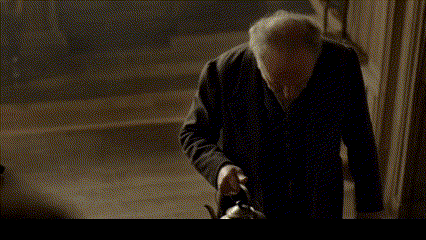

## Clayton Harrow  

Clayton Harrow is a disillusioned, middle-aged bureaucrat trapped in a life devoid of purpose. After discovering the existence of the SCN, he embarks on a journey that forces him to confront not only the forces manipulating reality but also the darkness within himself. His body and mind are corrupted, gradually transformed into a software-like entity, constantly fighting the SCN’s influence.

---

## Shiniza Yakavaze  
  

A deformed, elderly Japanese man confined to a wheelchair, Shiniza Yakavaze is a powerful antagonist deeply intertwined with the SCN. Though physically crippled, his mastery of the network allows him to manipulate reality itself. His deteriorated body is a reflection of the price paid for his manipulation of the SCN. His pistol-wielding arm makes him a formidable foe despite his frailty.

---

## Kettleback  
  

Kettleback is a strange and unsettling boss character who hobbles about while carrying a boiling kettle. His twisted spine and sluggish movements conceal a mind sharp enough to manipulate the SCN. He has survived numerous battles against forces unseen, but every victory has left a physical mark, symbolizing the cost of his power. His calm demeanor, despite his grotesque appearance, makes him a sinister figure.

---

## Ashkaboos  

Ashkaboos is a formidable and enigmatic figure who serves the Dining Philosophers with unwavering devotion. A true believer in their vision for the Soul Communication Network (SCN), he enforces their will with a zeal that is both terrifying and compelling. His body, distorted by years of SCN manipulation, reflects the profound changes within his mind. Unlike a mere puppet, Ashkaboos acts out of conviction, believing that his actions serve a greater good—even if it means imposing harsh realities on others. His presence embodies the complex interplay between righteousness and tyranny, making him a haunting adversary whose motives are as unsettling as his methods.

---

## Seamus O'Driscoll  

Seamus O'Driscoll is an old Irish mentor who guides Clayton through the treacherous reality of the SCN. Once a powerful manipulator of the network, Seamus is now weary and broken, having seen the toll the SCN takes on those who use it. His wisdom is invaluable, but his melancholy and fatigue suggest that he has little time left to guide Clayton.

---

## The Dining Philosophers (History)  

The Dining Philosophers are the hidden rulers of the SCN, an enigmatic group that manipulates the very fabric of human thought and emotion through the network. They have existed for centuries, slowly influencing society, sowing confusion and conflict, all to maintain their grip on power. Their history is filled with acts of manipulation, betrayal, and ruthless control, all in the name of order and stability. Their power comes at the cost of those who dare to oppose them, leaving a trail of corruption and devastation in their wake.
